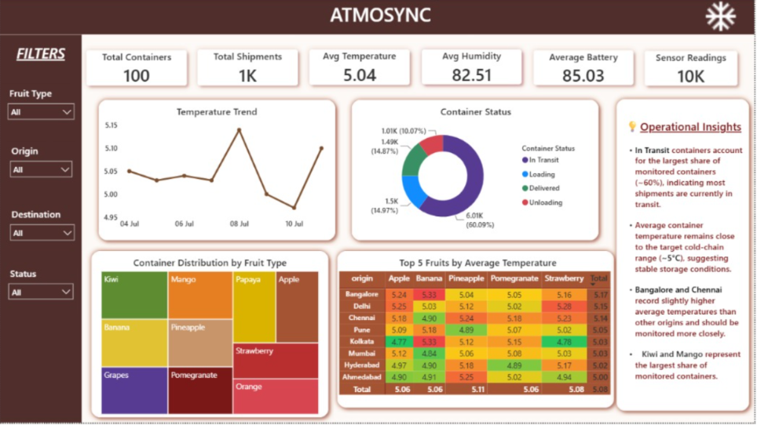

# 🌡️ ATMOSYNC – IoT Cold Chain Monitoring Dashboard

## 📌 Project Overview

ATMOSYNC is an IoT-powered Cold Chain Monitoring project that simulates real-time sensor data from refrigerated containers and visualizes key operational insights through an interactive Power BI dashboard.

The project demonstrates how IoT telemetry can be transformed into actionable business insights, enabling supply chain managers to monitor shipment conditions, ensure product quality, and improve operational efficiency.

---

## 🚀 Key Features

- 📦 Monitor Total Containers and Shipments
- 🌡️ Track Average Temperature
- 💧 Monitor Average Humidity
- 🔋 Monitor Average Battery Level
- 📡 Analyze Real-time Sensor Readings
- 📈 Temperature Trend Analysis
- 🍩 Container Status Distribution
- 🌳 Container Distribution by Fruit Type
- 📊 Top 5 Fruits by Average Temperature
- 📝 Operational Insights Panel
- 🎛️ Interactive Slicers for Data Exploration

---

# 🔄 IoT Sensor Data Simulator

A Python-based IoT simulator was developed to mimic real-world cold chain monitoring by generating continuous sensor readings for refrigerated containers.

### Simulator Workflow

- Reads container records from the dataset.
- Generates real-time sensor readings at fixed intervals.
- Automatically updates timestamps for every reading.
- Simulates realistic fluctuations in:
  - Temperature
  - Humidity
  - Battery Level
  - Vibration
- Preserves shipment and container information throughout the simulation.
- Produces a continuous stream of telemetry data for monitoring and analytics.

### Simulated Sensor Attributes

- Container ID
- Shipment ID
- Fruit Type
- Origin
- Destination
- Temperature
- Humidity
- Vibration
- Battery Level
- Door Status
- Latitude
- Longitude
- Timestamp

### Purpose

The simulator recreates an IoT-enabled cold chain environment, allowing real-time monitoring and dashboard development without requiring physical IoT devices.

---

# 📊 Dashboard Highlights

### Executive KPIs

- Total Containers
- Total Shipments
- Average Temperature
- Average Humidity
- Average Battery Level
- Total Sensor Readings

### Visualizations

- Temperature Trend Analysis
- Container Status Distribution
- Container Distribution by Fruit Type (Treemap)
- Top 5 Fruits by Average Temperature (Matrix)
- Operational Insights
- Interactive Filters

---

# 💡 Business Insights

- Identifies the current distribution of refrigerated containers across operational stages.
- Tracks temperature trends to ensure cold chain compliance.
- Monitors battery health of IoT devices for uninterrupted sensor operation.
- Highlights fruit categories requiring closer environmental monitoring.
- Provides operational insights for proactive decision-making.

---

# 🛠️ Technologies Used

- Python
- Power BI
- DAX
- Power Query
- Pandas
- NumPy

---

# 📂 Project Structure

```
ATMOSYNC/
│
├── Dashboard/
│   └── ATMOSYNC.pbix
│
├── Simulator/
│   ├── realtime_simulator.py
│   └── sensor_data.csv
│
├── Images/
│   └── dashboard.png
│
└── README.md
```

---

# 🔄 Project Workflow

```
Sensor Dataset
      │
      ▼
Python IoT Simulator
      │
      ▼
Real-time Sensor Data Generation
      │
      ▼
Power BI Dashboard
      │
      ▼
Cold Chain Monitoring & Operational Insights
```

---

# 📸 Dashboard Preview



```markdown

```

---

# 🎯 Project Objective

To simulate an IoT-enabled cold chain monitoring system and develop an interactive dashboard that helps monitor environmental conditions, shipment health, and operational performance through real-time sensor data visualization.

---

# 👩‍💻 Author

**Sayam Stuti**

- GitHub: https://github.com/sayamstuti
- LinkedIn: www.linkedin.com/in/sayam-stuti-shuvadarsini